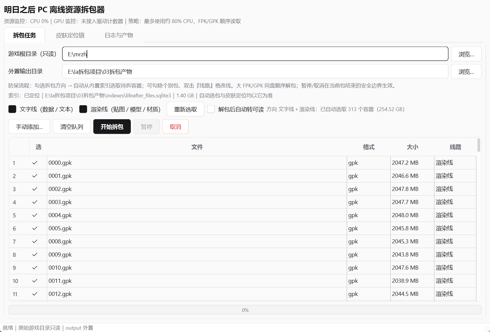
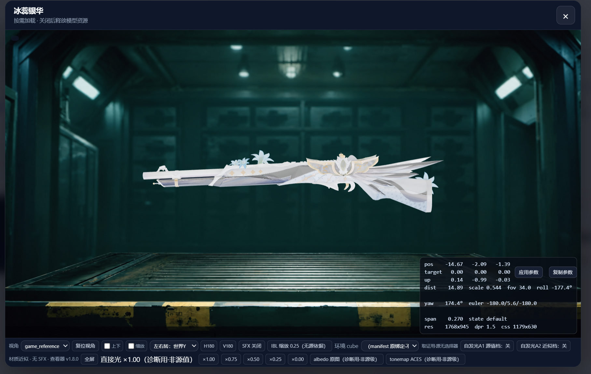

# LifeAfter Unpacker Toolkit（明日之后拆包工具箱）

> 个人研究向的《明日之后》(PC) 离线拆包工具集 —— 从只读源包到可读产物的一站式流水线。
>  屎山警告：长期个人迭代的产物，目录里同时有“权威链路”和“历史实验”，以 `readme.txt` 与 `统一索引与拆包流程.md` 为准。

## 仓库结构（01 / 02 / 08）

| 部分 | 内容 |
|---|---|
| `01拆包器本体/` | 拆包器本体（源码 / 工具链 / 3D 预览器；打包 exe 见 Releases） |
| `02文档索引/` | 资源盘点、差分与专题定位文档索引 |
| `08Lifeafter wiki/` | 图鉴 wiki 框架：板子（board.html）、皮肤查看器、工具链（tools/）、服务与管线（services/ pipelines/）、注册表（registry/） |

> 游戏数据与生成产物（`data/`、`artifacts/`、3D 贴图、音频、`03拆包产物` 等）已剔除，按工具链对本地只读源重跑即可再生成。

## 界面预览

| 拆包任务（防呆选包） | 皮肤 3D 预览器 |
| :---: | :---: |
|  |  |

## 下载

- **`明日之后拆包器_新.exe`（Windows，双击即用）** → 见 [Releases](../../releases/latest)


## 能力一览

- **统一文件索引（索引优先）**：逻辑路径 → 64 位 fid → 容器/行/偏移，一次构建（GPK/FPK/NPK 全量），全流程定点查询与提取。
- **双线拆包**：按「文字线（数据/文本）」与「渲染线（贴图/模型/材质）」分线归档，目录自动分树。
- **解包后自动转可读**（可选）：DDS/TGA/KTX → PNG；bin/二进制 → 字符串表；原文件永不动，产物入 `_readable/`。
- **防呆选取**：勾选拆包方向后按内置索引自动选取待拆容器，可逐项勾除。
- **武器皮肤定位链专题**：扫描 3D 素材目录 + 索引逐条定位源引用，可一键生成 Markdown 报告。
- **3D 预览器缝合**：与本地 Wiki 的皮肤海报预览器同源（three.js r180 + 本地静态服务，见交接文档）。

## 快速开始

> 以下命令均在 `01拆包器本体/` 内执行。

```bash
# 1) 依赖
pip install -r requirements.txt        # pycryptodome / Pillow / zstandard / lz4 / numpy 等
cp -r <本仓> <任意目录>；.buildenv 为本地重建（未入仓）

# 2) 构建统一索引（只读源包，产物在 output/indexes/）
python run_all.py index build
python run_all.py index status

# 3) 定点查询 / 提取
python run_all.py find "common\env_map\qiangpi.cube"
python run_all.py extract "common\env_map\qiangpi.cube" out.dds --container res.npk --row 14213
python run_all.py verify

# 4) GUI（PySide6）：本地构建
pyinstaller 工具库/10_应用核心/明日之后拆包器_新.spec
```

## 目录结构（简）

（均位于 `01拆包器本体/` 内）

| 路径 | 职责 |
|---|---|
| `工具库/00_资源索引` … `12_EXE脱壳分析` | 全部功能模块（按序） |
| `工具库/10_应用核心` | 统一索引核心 / toolkit_core / GUI 源码 / 契约测试 |
| `工具库/06_皮肤定位链` | 定位链 / 材质 / 渲染现役工具群（实验件已清） |
| `3D预览器/` | 通用模型预览页 + `poster/` 皮肤海报预览器（需本地 HTTP） |
| `run_all.py` | 命令行统一入口 |
| `统一索引与拆包流程.md` | 索引/拆包流程权威说明 |

## 自检

GUI 构建产物带一键自检：`--smoke` / `--index-smoke` / `--viewer-smoke` / `--unpack-smoke`（解包+可读化端到端）。
源码测试：`python -m unittest discover -s 工具库/10_应用核心/tests`（当前基线全绿）。

## 免责声明

- 本仓库仅供**个人学习 / 逆向工程研究**使用；**不包含任何游戏素材或数据**（贴图/模型/表格等一律不入仓）。
- 游戏及素材版权归 **网易 (NetEase)** 所有；请勿将本工具或其产物用于商业用途或传播游戏素材。
- 使用本工具须自行遵守当地法律与游戏用户协议；作者不对任何误用负责。
