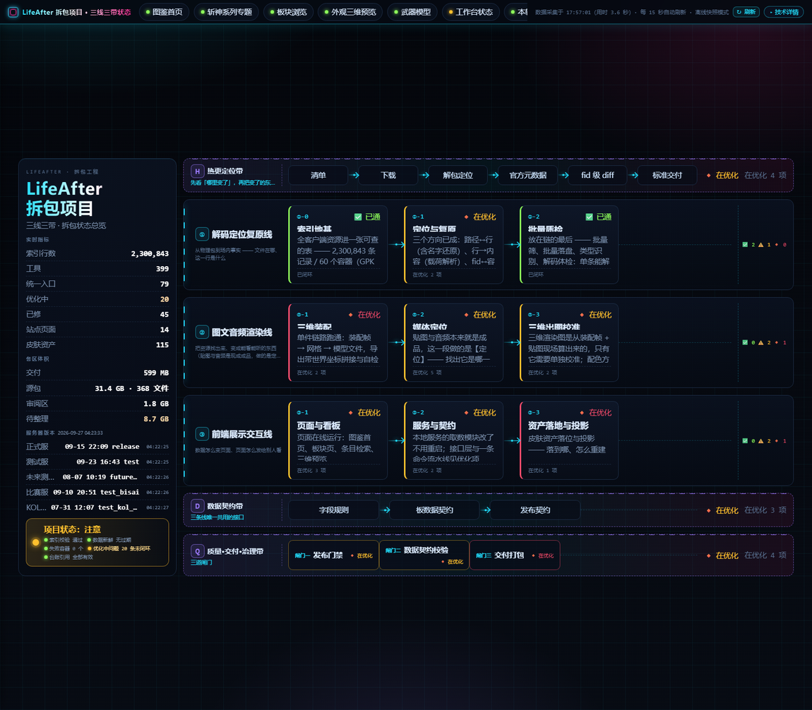
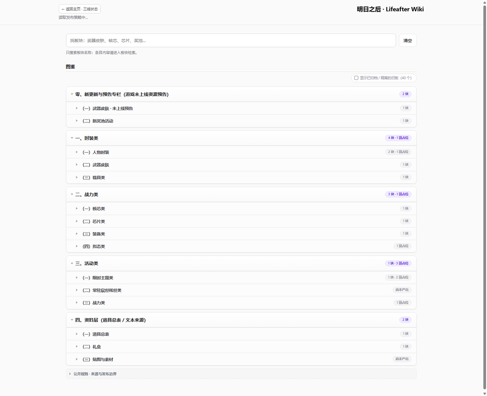
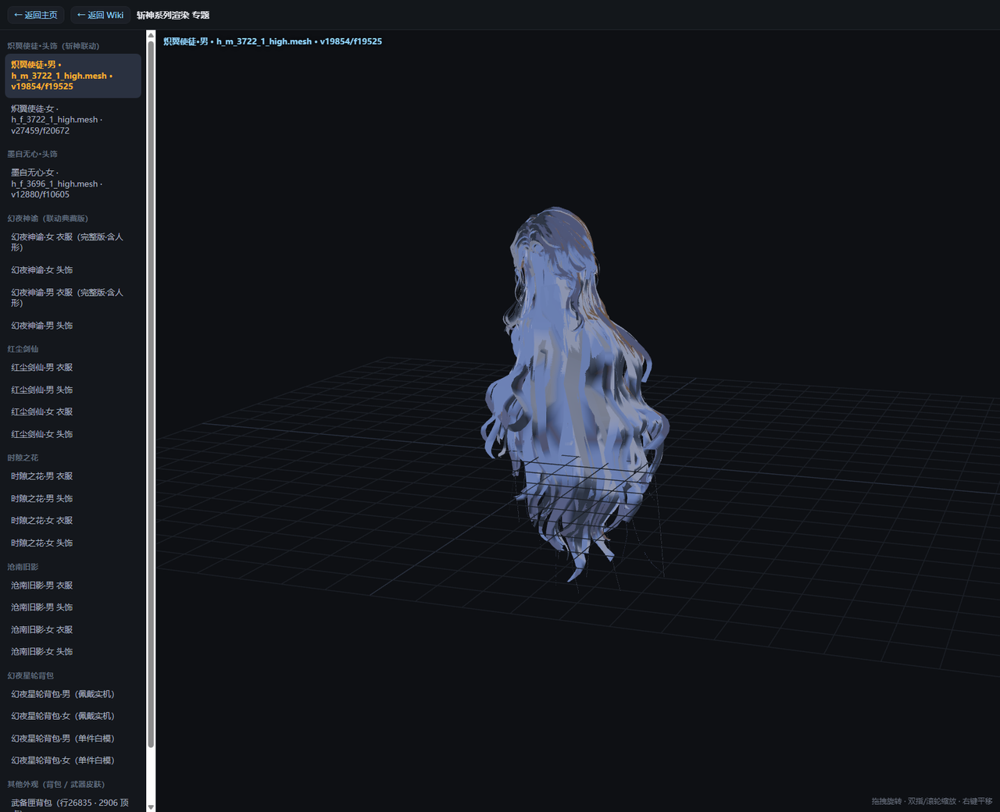
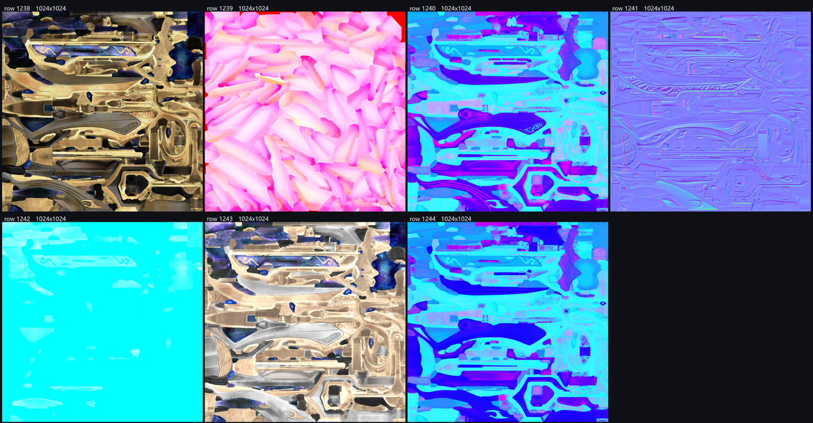
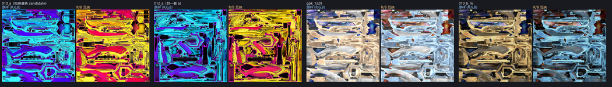

# 明日之后 拆包工作台

《明日之后》(LifeAfter / mrzh) 客户端资源**解码 · 定位 · 复原 · 可视化**工具链。

只读源包 ⇒ 建立索引 ⇒ 按名字/哈希精确定位 ⇒ 物化成还原树 ⇒ 出图/出页。
**不修改游戏客户端**，不做动态注入。

> **[⬇️ 下载最新版（Agent 接手包）](https://github.com/lespre/lifeafter-toolkit/releases/latest)**
> —— 一个包就能交接：解压 → 读 `docs/AGENT.md` → 跑 `verify` 即可开工。

## 主要功能：定位与渲染

> **核心能力 = 「定位」+「渲染」**：把一个游戏内资源从**海量容器里精确定位出来**，
> 再**按游戏产物原样渲染/呈现**。

| 领域 | 能做什么 |
|---|---|
| **时装** | 定位整装与部件（衣/发/挂件/贴花），还原材质槽位与配色 |
| **武器皮肤** | 定位皮肤模型 + 材质 + 贴图，还原槽位绑定与渲染链 |
| **奖池 / 活动** | 定位奖池定义、掉落权重、每期选品与新品下发 |
| **场景 / 展示台** | 定位预览场景（网格 + 贴图 + 天气 + 相机 + 光照） |
| **武器 / 装备** | 定位模型、装配帧（`.c159`）、属性表 |
| **音效 / 特效** | 定位 `.sfx` 轨道、特效部件与绑定贴图 |
| **配置表 / 图集** | BinDict 表解码、spine 图集、中文字表 |
| **不限于以上** | 只要在容器里，就能按同一套方法定位 |

### ★ 有测试服源 ⇒ 可定位「未上线内容」

```text
· 测试服（playertest）会先于正式服下发新皮肤/新时装/新奖池
· 只要手上是【测试服客户端 + 对应热更源】，就能：
    · 定位正式服还没有的资源
    · 做【正式服 vs 测试服】的 fid 级 diff ⇒ 提前知道这期上什么
· 判据与切服方法见 docs/CDN-AND-VERSION.md
· ⚠️ 服别不能混：APK/模拟器 = 正式服；PC 客户端可能是体验服 ⇒ 名字/fid 可能不同
```

**定位方法**（两类条目 + 四步法）见下方
[核心概念](#核心概念两类条目) 与 [资源定位四步法](#资源定位四步法)；
**渲染**见 [架构总览](#架构总览) 的「呈现链」。

---

## 效果预览

**① 项目总览页** —— 三线三带结构一张图看全（源包 → 索引 → 定位 → 还原 → 呈现）



**② 图鉴站（Wiki）首页** —— 定位成果的可视化出口



**③ 时装渲染（专题）** —— 从容器定位到模型/贴图，再按产物渲染



**④ 定位成果：皮肤自带的 7 张贴图** —— 从容器里按哈希锚定 + 邻接取出，非猜测



**⑤ 判身份不靠肉眼，靠数学** —— 通道恒定性 + 相关度自动判定类型



**⑥ 渲染链** —— 材质分层 → 成品


> ⚠️ 以上均为**工具产出**；仓库不含游戏原始资源与还原树。
> 图里出现的具体皮肤 / 活动仅作**技术演示**。

---

## 目录

- [这个仓库是什么](#这个仓库是什么)
- [主要功能：定位与渲染](#主要功能定位与渲染)
- [效果预览](#效果预览)
- [快速开始](#快速开始)
- [**用 Agent 快速接手**](#用-agent-快速接手)
- [核心概念：两类条目](#核心概念两类条目)
- [资源定位四步法](#资源定位四步法)
- [CLI 命令总览](#cli-命令总览)
- [常见工作流](#常见工作流)
- [架构总览](#架构总览)
- [容器格式备忘](#容器格式备忘)
- [目录结构](#目录结构)
- [环境要求](#环境要求)
- [常见坑](#常见坑)

**配套文档**：
[`docs/CLI.md`](docs/CLI.md) CLI 逐条手册 ·
[`docs/USAGE.md`](docs/USAGE.md) 实战工作流 ·
[`docs/AGENT.md`](docs/AGENT.md) **Agent 冷启动手册** ·
[`docs/CDN-AND-VERSION.md`](docs/CDN-AND-VERSION.md) **CDN 与版本体系（含切服）** ·
[`docs/APK-UNPACK.md`](docs/APK-UNPACK.md) **APK 拆包思路**

---

## 这个仓库是什么

| 层 | 内容 |
|---|---|
| **00_治理** | 台账 / 规范 / 索引（唯一权威描述来源） |
| **01_工具** | 全部工具链：解码定位复原 · 图文音频渲染 · 共享核心 |
| **04_站点** | 可视化页面（wiki / 3D 预览 / 看板） |

**不在仓库里**（体积大 / 可重建）：
`02_资料`（源包 45G）· `03_执行`（还原树 / 索引库）· `.venv` · 文档大件。

> 还原树、索引库、源包都可以由本仓库的脚本**从原始客户端重建**，
> 因此不入库；仓库只保留**代码 + 页面 + 文档**。

---

## 快速开始

```bash
# 0) 依赖
python -m venv .venv
.venv/Scripts/pip install -r 01_工具/requirements.lock.txt

# 1) 每次开工必做：把共享核心放进 PYTHONPATH
export PYTHONPATH="$PWD/01_工具/工具库/00_共享核心"     # Linux/macOS
set PYTHONPATH=%CD%\01_工具\工具库\00_共享核心          # Windows cmd

# 2) 自检（索引 + 三条已知路径端到端）
python 01_工具/工具库/00_共享核心/命令行/toolkit_cli.py verify

# 3) 看全部命令
python 01_工具/工具库/00_共享核心/命令行/toolkit_cli.py --help
```

> ⚠️ **不加 `PYTHONPATH` 会报 `ModuleNotFoundError: No module named 'toolkit_core'`** —— 这是最常见的第一个坑。

---

## 用 Agent 快速接手

把仓库地址丢给任意 AI Agent，**先让它读这三份**：

```text
README.md        ← 全貌 + 两类条目 + 资源定位四步法
docs/CLI.md      ← 42 个命令，别自己造轮子
docs/USAGE.md    ← 实战工作流 + 验收纪律
docs/AGENT.md    ← Agent 冷启动手册（30 秒了解 / 开工三件事 / 8 个坑 / 硬规则）
```

然后一句开场：

> 设好 `PYTHONPATH`，跑 `verify`，读 `README.md` + `docs/CLI.md`。
> **`0 命中` 先查代码后疑数据**；**引用逐字读**；**哈希自证**；
> **源包只读、服别不混、不编数据**。

### Agent 开工三件事（缺一必翻车）

```bash
export PYTHONPATH="$PWD/01_工具/工具库/00_共享核心"      # 不设必报 toolkit_core
python 01_工具/工具库/00_共享核心/命令行/toolkit_cli.py verify
curl -s -o /dev/null -w '%{http_code}\n' http://127.0.0.1:8770/   # 000 = 服务死了
```

### Agent 必须知道的四条硬规矩

| 规矩 | 原因 |
|---|---|
| **`0 命中` 先怀疑代码** | 函数用错（gres 用 `parse_gpk`）、偏移错、路径写法错 —— 90% 是代码问题 |
| **引用逐字读** | 一个字符不同 ⇒ `murmur3` fid 全变 ⇒ 必然 0 命中 |
| **哈希自证** | 拿**已知命名文件**算 fid 必须命中；不中 = 方法错，不是数据没有 |
| **源包只读 / 服别不混 / 不编数据** | 安全底线 + PC 与 APK 可能不同服 ⇒ 结论必须标服别 |

> 详细版（含 8 个高频坑与对策）见 **[docs/AGENT.md](docs/AGENT.md)**。

---

## 核心概念：两类条目

容器里的条目分两种，**不要用同一套方法硬套**：

| 类型 | fid 的来源 | 定位方式 |
|---|---|---|
| **有名条目** | `fid = murmur3_x86_32(路径)` 双 seed<br>高 32 位 seed `0x77777777`，低 32 位 seed `0x66666666` | 算哈希 ⇒ 直接命中容器行 |
| **无名条目** | 引擎内部 id（**不是**路径哈希） | ① 邻接（同资源块连排）<br>② `.c159` / `.mtg` 槽位语义<br>③ 通道统计（见下） |

> **`row_path_map.db` 里无名行的 `fid_hex` 是占位路径算出来的，不能用于认领** ——
> 真 fid 只存在于**容器条目表**里。

### 无名贴图的身份判定（纯数学，不用肉眼）

| 特征 | 判定 |
|---|---|
| `R≈G≈128` 且 `B>200` | 法线图（标准） |
| `B` 通道 `std<1.5` 且 `B>200` | 法线图（细节） |
| ≥2 个通道 `std<1.5` | 单通道数据图（蒙版 / 发光） |
| `R` 恒 `255`（`std≈0`） | 参数图 ParamMap |
| `R/G` 相关 `>0.8` 且饱和 `>40` | **基色图** |
| `R/G` 相关 `>0.8` 且饱和 `≤40` | 表面图 / 灰度图 |

---

## 资源定位四步法

```text
① 读引用   从 .mtg / .c159 【逐字】抽路径串（绝不手打路径）
           正则：[\x20-\x7E]{5,220}\.(tga|dds|png|cube|array|ktx)
② 算哈希   path_id_raw(path) → 16 位 hex
③ 锚定行   拿哈希去容器 rows 找 fid ⇒ (容器, 行号, 偏移, 解压后尺寸)
           索引库能命中的先命中；命中不了的多半是【无名条目】
④ 判身份   无名条目 ⇒ 邻接 / 槽位语义 / 通道统计
```

**一键脚本**：

```bash
# 从引用文件解出它要的资源并定位
python 01_工具/工具库/02_图文音频渲染/皮肤链与渲染/resolve_asset.py \
  --ref "<某个.mtg或.c159>" --container 'res\weapon.gpk'

# 按名字找文件
python .../resolve_asset.py --find 'skin_1003_010' --ext mtg

# 批量判贴图身份（不用肉眼）
python .../resolve_asset.py --semantic "<png目录>"
```

> **一个字符不同 ⇒ fid 全变 ⇒ 必然 0 命中。**
> 所以引用必须从文件里**逐字读**，不能凭印象写。

---

## CLI 命令总览

完整参数见 **[docs/CLI.md](docs/CLI.md)**。这里按用途速查：

### 索引与定位

```bash
toolkit_cli.py index build              # [①-0] 建统一文件索引
toolkit_cli.py verify                   # [①-0] 索引 + 已知路径端到端自检
toolkit_cli.py names lookup <路径>       # [①-1] 游戏内路径 → 哪个包、哪一行
toolkit_cli.py find <逻辑路径>           # [①-1] 逻辑路径查全部物理候选
toolkit_cli.py locate <容器> <行号>      # [①-1] 容器+行 → 产物文件
toolkit_cli.py locate --fid <16位hex>   # [①-1] fid 反查它落在哪个容器哪一行
toolkit_cli.py extract <容器> <行号>     # [①-1] 定点提取一个条目
toolkit_cli.py materialize              # [①-1] 产物 → 还原树（按源路径硬链接）
```

### 资源提取与解码

```bash
toolkit_cli.py bulk <目标> --out <目录>   # [①-2] 批量提取：断点续跑 + 清单 + 类型识别
toolkit_cli.py identify <目标>            # [①-2] 魔数 → 纹理/配置/网格/音频
toolkit_cli.py tex <dds目录> --out <目录> # [②-2] 贴图 → PNG（DDS/BC7/KTX）
toolkit_cli.py audio <sfx> --out <目录>   # [②-2] 音效轨道 .sfx → 帧表 JSON
toolkit_cli.py glb <mesh...> --out a.glb  # [②-1] .mesh → GLB（世界坐标拼接）
toolkit_cli.py sheet <.c159>              # [②-1] 装配帧 → 材质/部件表
toolkit_cli.py render <材质>              # [②-3] 材质分层出图
toolkit_cli.py shader list|info|export    # [横切] 着色器层：拆 .dxbc / .asm
```

### 热更与散文件层

```bash
toolkit_cli.py loose scan --out <目录>    # [H-2] 散文件层 .idx/.wpk 解密 → 明文
toolkit_cli.py loose match --dir <目录>   # [H-2] 内容 MD5 → 容器+行号（不靠名字）
toolkit_cli.py hotfix all|report|bundle|rows|patchlog|apply   # [带H] 热更线总入口
toolkit_cli.py delta                      # [H-1] 正式服 vs 测试服差在哪
toolkit_cli.py snapshot                   # [H-2] 本地容器快照与终态判定（只读）
```

### 配置表 / 奖池 / 图集

```bash
toolkit_cli.py tables list|find|chs|refimg|copies   # 配置表层
toolkit_cli.py lottery list|find|show|delta        # 奖池层
toolkit_cli.py atlas list|discover|export          # spine 图集层
toolkit_cli.py servers                             # 服型后缀总表
```

### 体检与审计

```bash
toolkit_cli.py overview                  # 全格式概览：NPK 条目数 + FPK 包分类
toolkit_cli.py decode-audit              # 按【容器×flag】分层抽样体检
toolkit_cli.py bridge-audit              # 皮肤逻辑路径 → IDX/WPK 物理桥审计
toolkit_cli.py map --seg ②-2             # 工具 × 段位 映射表
toolkit_cli.py export <输入> --out x.csv # 解析结果 → 表格（csv/json/md）
```

### 全局参数

```bash
--root ROOT         项目根（覆盖环境变量与自动探测）
--jobs auto|N       并行数（auto = 按硬件+任务类型自动）
--cpu-limit 80      整机 CPU 占用上限 %（超了自动让路）
--gpu-limit 80      GPU 占用上限 %
--gpu auto|on|off   GPU 加速
--no-throttle       关掉反馈限流（跑满机器）
```

---

## 常见工作流

### A. 找某张资源在哪

```bash
# 1) 先按名字查
toolkit_cli.py names lookup 'weapon\skin\skin_1003_010\skin_1003_010.mtg'

# 2a) 命中 ⇒ 直接取
toolkit_cli.py locate 'res\weapon.gpk' 1225

# 2b) 未命中 ⇒ 多半是【无名条目】：从引用文件入手
python resolve_asset.py --ref "<.mtg>" --container 'res\weapon.gpk'
#    再按【邻接】找同资源块的贴图（同容器行号邻近）
```

### B. 新皮肤/新资源全链复原

```bash
toolkit_cli.py hotfix apply             # 把本次热更就地增补进还原树（默认 dry-run）
toolkit_cli.py loose scan --out out/    # 散文件层解密
toolkit_cli.py loose match --dir out/   # 内容寻址 ⇒ 容器+行号
toolkit_cli.py tex out/ --out png/      # 贴图 → PNG
```

### C. 出可视化页面

```bash
python 01_工具/工具库/02_图文音频渲染/皮肤链与渲染/serve_web.py 8770
# 浏览器打开 04_站点/web/ 下的页面
```

---

## 架构总览

```text
┌─────────────────────────────────────────────────────────────────────┐
│  源包（只读）        E:\mrzh  …  02_资料/源包/                       │
│  gpk(HPGF) · npk(NXPK) · fpk · 散文件层(idx/wpk) · APK · 热更包      │
└───────────────────────────────┬─────────────────────────────────────┘
                                │  toolkit_cli index build
                                ▼
┌─────────────────────────────────────────────────────────────────────┐
│  03_执行/10_索引     容器条目表 · 行→路径映射 · 名字字典 · 热更快照    │
│                      ★ 一切查询的底座（不入库，可重建）               │
└───────────────────────────────┬─────────────────────────────────────┘
                                │  names / locate / find / resolve_asset
                                ▼
┌─────────────────────────────────────────────────────────────────────┐
│  03_执行/41_还原树   ★★★ 唯一权威资源树（层级对标真实客户端路径）      │
│                      <容器>/<路径>  +  <容器>/_未命名/<行号>          │
└───────┬─────────────────────────────────────┬───────────────────────┘
        │  tex / glb / sheet / render / audio  │  materialize / bulk
        ▼                                     ▼
┌──────────────────────────────┐   ┌──────────────────────────────────┐
│  03_执行/20_提取 · 30_分析    │   │  04_站点/web  可视化              │
│  PNG · GLB · 表 · 帧 JSON     │   │  wiki · 3D 预览 · 看板            │
└──────────────────────────────┘   └──────────────────────────────────┘

横切工具：tables(配置表) · lottery(奖池) · shader(着色器) · atlas(图集)
          servers(服型) · content(内容指纹) · sched(调度) · map(工具×段位)
热更线：  hotfix(总入口) · delta(版本差) · loose(散文件层) · snapshot(快照) · ovl
```

**四条链路**：

| 链路 | 做什么 |
|---|---|
| **索引链** | 源包 → 条目表 → 行→路径 → 名字字典 |
| **定位链** | 路径/fid → 容器 + 行号 → 产物文件 |
| **还原链** | 产物 → 按源路径物化 → 还原树（硬链接，幂等） |
| **呈现链** | 还原树 → 贴图/模型/表 → PNG / GLB / 页面 |

---

## 容器格式备忘

| 扩展名 | 格式 |
|---|---|
| `.gpk` (res 族, 56 个) | `HPGF` · 16B 头 + 块链 + **32B/条** `(off, comp, dec, c1, c2, flag, hash_lo, hash_hi)` |
| `.gpk` (`Documents/gres/*`, 35 个) | 同块链 · **多块**（单文件实测 56 块）⇒ 必须用 `parse_gpk_gres` |
| `.npk` | `NXPK` · AES-ECB 头/表 + 48B 条目 |
| 热更 `.idx` | `SKPW` · 头 36B + **36B/条** |
| 热更 `.wpk` | `FKPW`（可能是空占位） |
| 热更载荷片 | `1DPW` · 魔数 + u32 + **16B MD5 = 文件名** + 加密体 |
| BinDict 表体 | 外层 `x{` + u32(len)；内层 `[count][48B 保留][u32 池长][值流][行体]` |

**值流 tag**：`0x12`=f32 · `0x22`=f64 · `0x03`=bool · `0x0b`=ref · `07 03`=分组

> 散文件层（NeoX 机制：**优先读散文件，没找到才读资源包**）：
> `Documents/res/*.idx + *.wpk` = 客户端**额外下载**的文件 ⇒ 新内容多在里层。

---

## 目录结构

```text
la拆包项目/
├── 00_治理/                     台账 · 规范 · 索引（权威描述来源）
├── 01_工具/
│   ├── run_all.py               总入口
│   ├── requirements.lock.txt
│   └── 工具库/
│       ├── 00_共享核心/
│       │   ├── toolkit_core/    ★ 核心库（解析器/解码器/索引/路径哈希）
│       │   ├── 命令行/           ★ toolkit_cli.py 统一入口
│       │   └── 命令行/neox_dis.py · symtab.py · cocode.py · blobs2.py
│       ├── 01_解码定位复原/      解包 · 扫描 · 定位
│       ├── 02_图文音频渲染/      ★ 皮肤链与渲染 · 3D预览器 · 纹理转换
│       └── 06_引擎逆向/          引擎侧取证
├── 04_站点/
│   └── web/                     预览页（skin_preview_v2 / skin_src_render / board / index）
├── 02_资料/                     ✗ 不入库（源包 45G）
└── 03_执行/                     ✗ 不入库（还原树 / 索引库）
```

---

## 环境要求

- **Python 3.12**（`.venv`）
- Windows（源包路径默认 `E:\mrzh`）
- 可选：`astcenc`（KTX/ASTC 解码）· `OIIO`（贴图交叉校验）
- 依赖清单：`01_工具/requirements.lock.txt`

---

## 常见坑

| 现象 | 原因 | 解法 |
|---|---|---|
| `ModuleNotFoundError: toolkit_core` | 没设 PYTHONPATH | 见[快速开始](#快速开始) |
| `载荷里找不到 'x{' 表体标记` | 传入的 payload 不对（不是表的问题） | 直接按 `x{ + u32(len)` 切 |
| `expected_single_block_got_56` | 把 `parse_gpk` 用在 gres 族上了 | 用 `parse_gpk_gres` |
| `'function' object is not iterable` | `parse_gpk` 返回的 `rows` 是**函数** | `rows_fn()` |
| 解析结果全 0 / 找不到资源 | **先怀疑代码**（函数 / 偏移 / 路径写法），再怀疑数据 | 用已知命名文件做自证 |
| 页面"改了没生效" | ① web 服务静默死 ② 资源 404 ③ 报错被吞 | 先探活 ⇒ 看网络 ⇒ 读 `window.__dbg` |

> **经验法则**：`0 命中` 先查代码，后疑数据。
> 4 字节哈希在 ~90 MB 高熵数据里命中**可能只是巧合** —— 必须验完整 8 字节。

---

## 许可与免责

仅供**学习研究**。请遵守游戏用户协议 —— 不要修改客户端文件、不要动态注入、
不要连接未授权服务器。
